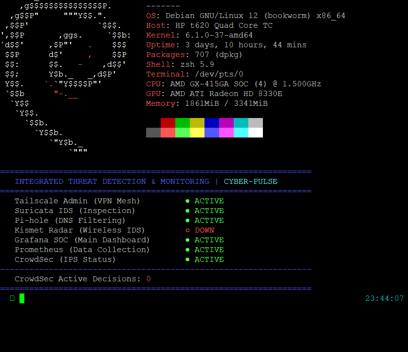
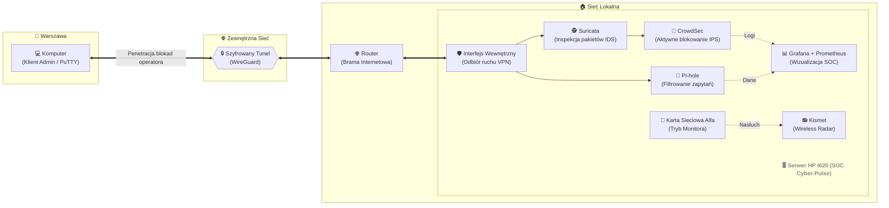
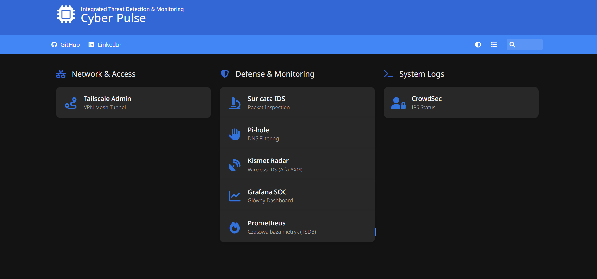

# 🛡️ Cyber-Pulse: Integrated Threat Detection & Monitoring (SOC)

**Cyber-Pulse: Prywatne, domowe Centrum Operacyjne Bezpieczeństwa (SOC). Zbudowane z użyciem WireGuard do omijania blokad operatora (CGNAT), Suricata (IDS) i CrowdSec (IPS) do aktywnej obrony przed zagrożeniami oraz Pi-hole do filtrowania DNS. Posiada autorski panel zarządzania w terminalu Zsh oraz w pełni skonteneryzowaną analitykę (Prometheus + Grafana) do automatycznego monitorowania sieci.**

---

## 🖥️ Platforma Sprzętowa (Hardware)
Sercem całego systemu jest energooszczędny terminal (Thin Client), który idealnie sprawdza się w roli bezgłośnego, domowego serwera pracującego w trybie 24/7. Wykorzystanie lekkich narzędzi i konteneryzacji pozwala na płynne działanie systemów bezpieczeństwa na ograniczonych zasobach.

 * 🖥️ **Urządzenie:** HP t620 Thin Client
 * 🐧 **System Operacyjny:** Debian GNU/Linux
 * 🧠 **Procesor (CPU):** AMD GX-415GA SOC (Quad-Core) @ 1.50 GHz
 * ⚙️ **Pamięć RAM:** 4 GB DDR3L
 * 💾 **Dysk (Storage):** 120 GB M.2 2242 SATA III SSD (TLC)
 * 📡 **Moduł Zwiadu Radiowego:** Zewnętrzna karta sieciowa USB **Alfa Network AWUS036AXM (Wi-Fi 6E)**. Zewnętrzna karta sieciowa USB Alfa Network AWUS036AXM (Wi-Fi 6E). Skonfigurowana w trybie monitora / packet injection na potrzeby systemu nasłuchu Kismet.

  
<strong>▶️ Panel CLI Cyber-Pulse (Kliknij, aby rozwinąć)</strong>

   
  

---

## 📂 Struktura Repozytorium

W tym repozytorium udostępniam główny kod konfiguracyjny, który napędza moje środowisko:

* `docker-compose.yml` – Plik wdrożeniowy w standardzie **Infrastructure as Code (IaC)**. Definiuje, mapuje i stawia całe środowisko analityczne (bazy danych i wizualizację) w odizolowanych kontenerach Dockera, zapewniając pełną powtarzalność środowiska.
* `cyberpulse.sh` – Mój autorski skrypt powitalny napisany w Bashu. Działa jako terminalowy panel dowodzenia: wyciąga dane sprzętowe, weryfikuje statusy krytycznych usług bezpieczeństwa (Suricata, CrowdSec, Pi-hole) i odpytuje zaporę o liczbę aktualnie zablokowanych intruzów, wyświetlając raport od razu po zalogowaniu przez SSH.

---

## 🏗️ Architektura Sieci

* **Szyfrowany tunel (VPN):** Zapewnia bezpieczny, zdalny punkt wejścia do sieci domowej z zewnątrz.
* **Lokalny serwer DNS:** Pełni rolę pierwszej linii obrony i "czarnej dziury" dla niechcianego ruchu.
* **System IDS/IPS:** Duet narzędzi do głębokiej inspekcji ruchu sieciowego oraz automatycznego blokowania ataków.
* **Środowisko analityczne (Docker):** Odizolowana warstwa odpowiedzialna za ciągłe zbieranie logów i wyświetlanie ich na głównym ekranie dowodzenia.
* **Radar Wi-Fi:** Niezależny moduł z zewnętrzną kartą sieciową do monitorowania przestrzeni radiowej wokół domu.

Dokładny podział ról oraz technologie wykorzystane w każdej z tych warstw zostały opisane w dalszej części dokumentacji.

---

🏠 Portal startowy
* **Homer:**
  * **Do czego służy:** Lekka, statyczna strona startowa serwera.
  * **Dlaczego to rozwiązanie:** Działa jako główny "Hub" nawigacyjny całego centrum SOC. Zamiast pamiętać dziesiątki portów i adresów IP dla Grafany, Pi-hole czy innych usług, Homer zapewnia scentralizowany, estetyczny panel w przeglądarce, z którego można jednym kliknięciem przejść do każdego modułu zarządzania w Home Labie.

  
<strong>▶️ Portal startowy HOMER (Kliknij, aby rozwinąć)</strong>

   
  

---

## ⚙️ Szczegółowy Opis Komponentów i Technologii

Poniżej znajduje się szczegółowe zestawienie narzędzi wykorzystanych w projekcie. Każdy element został dobrany tak, aby realizował konkretne zadanie w łańcuchu bezpieczeństwa, nie obciążając przy tym nadmiernie zasobów terminala HP.

### 1. Zdalny Dostęp i Komunikacja
* **WireGuard (via Tailscale):**
  * **Do czego służy:** Tworzy w pełni szyfrowany wirtualny tunel (Mesh) między zdalnym klientem a serwerem domowym.
  * **Dlaczego to rozwiązanie:** Pozwala na bezpieczne zarządzanie systemem z zewnątrz. Użycie platformy **Tailscale** jako warstwy kontrolnej dla protokołu WireGuard w pełni automatyzuje wymianę kluczy kryptograficznych i zarządzanie siecią. Narzędzie to wykorzystuje zaawansowany mechanizm *UDP hole punching* (oraz szyfrowane serwery przekaźnikowe DERP w ostateczności), co skutecznie penetruje surowe blokady NAT i CGNAT narzucane przez dostawców internetu (ISP). Dzięki temu serwer nie wymaga publicznego adresu IP, modyfikacji ustawień na głównym routerze domowym ani otwierania wrażliwych portów, zapewniając stabilne połączenie punkt-punkt (Peer-to-Peer).

### 2. Aktywna Obrona i Filtrowanie (Tarcza)
* **Pi-hole (DNS Sinkhole):**
  * **Do czego służy:** Pełni rolę lokalnego serwera DNS dla całej sieci.
  * **Dlaczego to rozwiązanie:** Analizuje każde zapytanie sieciowe wysyłane przez urządzenia domowe (np. telefony, smart TV, czujniki IoT). Jeśli zapytanie prowadzi do znanej domeny ze złośliwym oprogramowaniem, telemetrią lub reklamami, Pi-hole natychmiast je blokuje (odpowiada adresem `0.0.0.0`), oszczędzając przepustowość i chroniąc urządzenia przed infekcją.
* **Suricata (Intrusion Detection System - IDS):**
  * **Do czego służy:** System wczesnego ostrzegania dokonujący głębokiej inspekcji pakietów (Deep Packet Inspection).
  * **Dlaczego to rozwiązanie:** Nasłuchuje na interfejsach sieciowych i analizuje ruch w czasie rzeczywistym pod kątem sygnatur znanych ataków, wirusów czy anomalii. Wyłapuje skomplikowane zagrożenia sieciowe, których nie widać w standardowych logach systemowych.
* **CrowdSec (Intrusion Prevention System - IPS):**
  * **Do czego służy:** Strażnik behawioralny i menedżer firewalla.
  * **Dlaczego to rozwiązanie:** Analizuje logi tekstowe generowane m.in. przez system, usługi SSH czy Suricatę. W przypadku wykrycia agresji (np. ataku *brute-force*) natychmiast odcina adres IP intruza na poziomie głównej zapory. CrowdSec łączy się również z globalną bazą zagrożeń (CAPI), proaktywnie blokując adresy, które atakują obecnie inne serwery na świecie.

### 3. Zwiad Radiowy (Wireless Security)
* **Kismet + Alfa AWUS036AXM:**
  * **Do czego służy:** Zaawansowany radar przestrzeni powietrznej Wi-Fi.
  * **Dlaczego to rozwiązanie:** Zewnętrzna karta sieciowa z chipsetem wspierającym standard Wi-Fi 6E została wprowadzona w tryb monitora (Monitor Mode). System bezgłośnie "nasłuchuje" fal radiowych, wykrywając nieautoryzowane próby połączeń, ataki deautentykacyjne na lokalne routery oraz obce urządzenia zbliżające się do fizycznej strefy bezpieczeństwa.

### 4. Telemetria, Wizualizacja i Alerting (Monitoring & IR)
* **Docker i Docker Compose:**
  * **Do czego służy:** Platforma do lekkiej wirtualizacji i zarządzania kontenerami.
  * **Dlaczego to rozwiązanie:** Zapewnia higienę systemu. Narzędzia analityczne (Prometheus, Grafana) zostały zamknięte w odizolowanych kontenerach. Gwarantuje to brak konfliktów z głównym systemem operacyjnym (Debian) oraz wdraża profesjonalne podejście.
* **Prometheus:**
  * **Do czego służy:** Potężna czasowa baza danych (Time-Series Database).
  * **Dlaczego to rozwiązanie:** Co kilkanaście sekund odpytuje system i usługi sieciowe o ich stan (np. utylizacja procesora, statystyki zablokowanych reklam, liczba banów w CrowdSec). Pamięta historyczne statystyki z dokładnością do pojedynczych sekund.
* **Grafana:**
  * **Do czego służy:** Interaktywny interfejs analityczny.
  * **Dlaczego to rozwiązanie:** Czerpie suche dane z Prometheusa i przekształca je w dynamiczne dashboardy. Pozwala na błyskawiczną, wizualną ocenę stanu bezpieczeństwa.
* **Integracja z Telegramem (Push Notifications):**
  * **Do czego służy:** System natychmiastowego powiadamiania na smartfon.
  * **Dlaczego to rozwiązanie:** Wprowadza do projektu elementy *Incident Response* (reagowania na incydenty). Zamiast polegać tylko na ręcznym sprawdzaniu wykresów, system wysyła alerty w czasie rzeczywistym (np. o zablokowanych atakach) prosto do kieszeni administratora.

### 5. Interfejs Zarządzania (Command Line)
* **Zsh + Powerlevel10k + `cyberpulse.sh`:**
  * **Do czego służy:** Terminalowe centrum dowodzenia w PuTTY.
  * **Dlaczego to rozwiązanie:** Standardowa powłoka Bash została zastąpiona nowocześniejszym Zsh. Autorski skrypt powitalny automatycznie agreguje najważniejsze dane sprzętowe (via Neofetch) oraz weryfikuje na żywo stany usług systemowych i blokad, dostarczając pełen raport o sytuacji zaledwie w sekundę po zalogowaniu na serwer.
    
### 6. Portal Startowy i Reagowanie na Incydenty (UX & Alerting)
* **Homer (Web Dashboard):**
  * **Do czego służy:** Lekka, statyczna strona startowa serwera (tzw. landing page).
  * **Dlaczego to rozwiązanie:** Działa jako główny "Hub" nawigacyjny całego Home Labu. Zamiast pamiętać dziesiątki portów i adresów IP dla Grafany, Pi-hole czy innych usług, Homer zapewnia scentralizowany, estetyczny panel w przeglądarce, z którego można jednym kliknięciem przejść do każdego modułu zarządzania.
* **Integracja z Telegramem (Push Notifications):**
  * **Do czego służy:** System natychmiastowego powiadamiania o krytycznych zdarzeniach na smartfon.
  * **Dlaczego to rozwiązanie:** Aktywny SOC nie może polegać wyłącznie na ręcznym sprawdzaniu wykresów przez administratora. Wykorzystanie botów i webhooków Telegrama pozwala na wysyłanie alertów w czasie rzeczywistym (np. o zablokowanych atakach lub padnięciu usługi) prosto do kieszeni, skracając czas reakcji na incydent do absolutnego minimum.

---

### ⏳ Ciąg dalszy nastąpi... (To be continued)
Projekt **Cyber-Pulse** to żywy organizm, który stale ewoluuje. Wraz z odkrywaniem nowych wektorów ataków i testowaniem kolejnych narzędzi analitycznych, infrastruktura będzie się rozrastać.

---

🛡️ **Stworzone z pasją do Cyberbezpieczeństwa.** *Autor: **Paweł Zajczyk** 📫 **[LinkedIn]https://www.linkedin.com/in/pawel-zajczyk/**!
